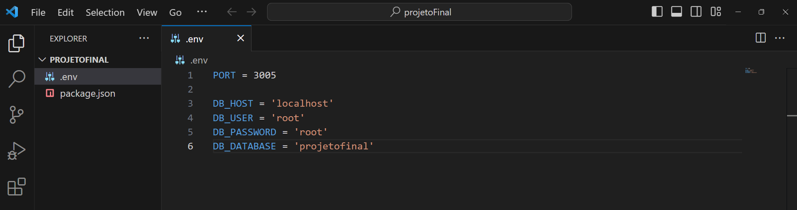
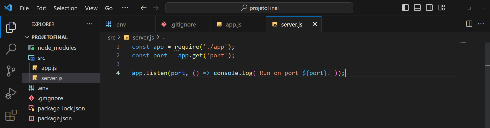
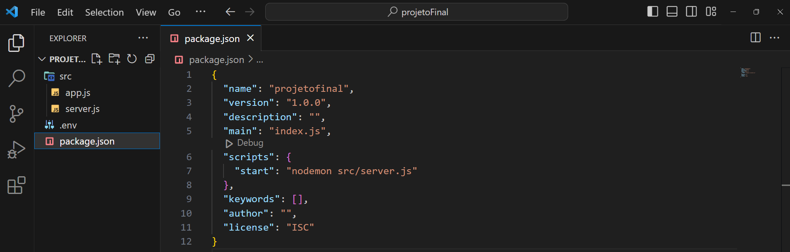
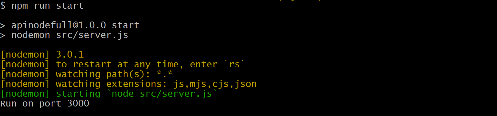
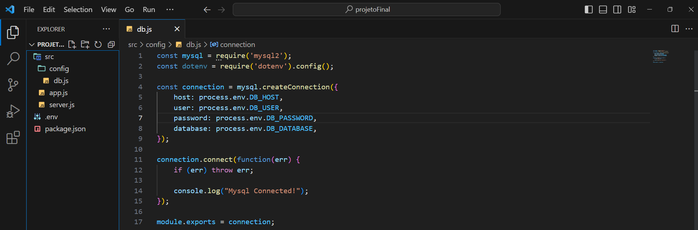
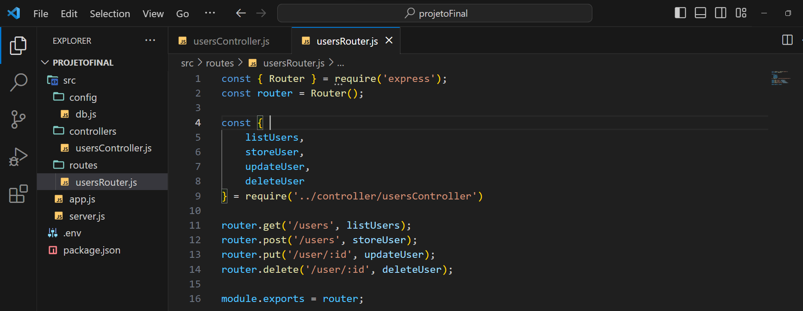
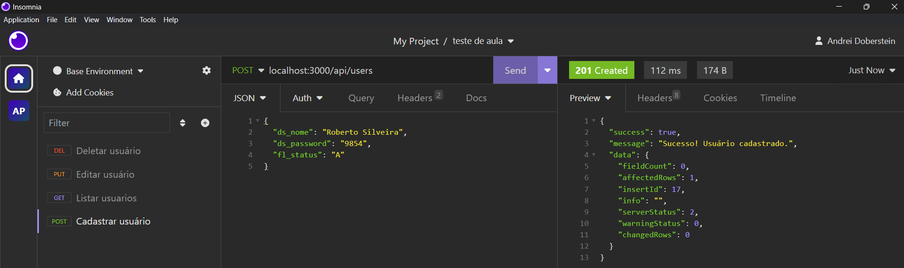
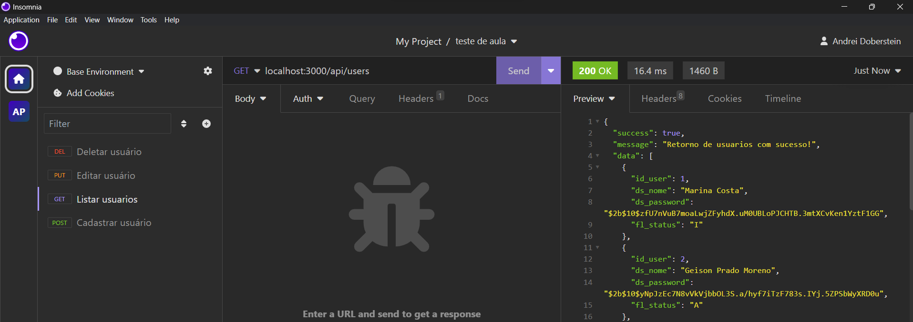
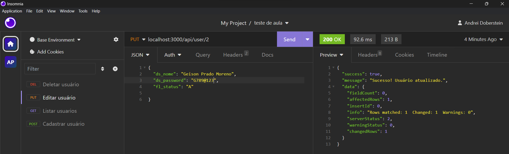
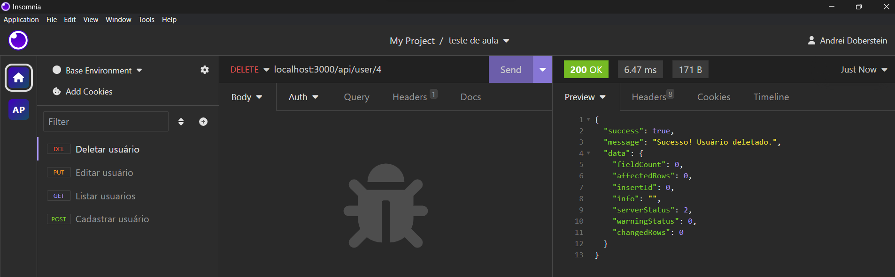

# CRUD REST API com Node, Express e MySql 👨‍💻

## Informações neste passo a passo ✅
* Criar o banco de dados
* Criar a API
* Conectar com banco de dados
* Criar rotas
* Criar controllers
* Listagem de clientes
* Adicionar um client
* Atualizar um cliente
* Excluir um cliente
* Testar com insomnia

## Criando o banco de dados
Criar a base de dados
```
create database projeto_final;
```
Selecionar a base
```
use projeto_final;
```
Criar tabela users
```
create table users(
    id_user int auto_increment not null, 
    ds_nome varchar(120) not null,
    ds_password varchar(120) not null, 
    fl_status enum('A','I') default('A'),
    primary key (id_user)
)
```
## Criando a API
Abrir o gitBash em pasta de sua preferencia e criar uma pasta com terminal para guardar os arquivos do seu projeto Node.js
```
mkdir projetoFinal
```
Acessar a pasta do projeto
```
cd projetoFinal
```
Criar o arquivo package.json para gerenciar os pacotes do Node
```
npm init -y
```
Instalar pacotes que vamos precisar para o projeto
```
npm i express nodemon mysql2 dotenv cors bcrypt
```
Responsabilidades destes pacotes:

* express: framework web para construção da infraestrutura da API; 
* nodemon: monitora as mudanças nos arquivos do projeto e reinicia automaticamente o servidor Node;
* mysql2: conectar e mandar comandos SQL para o banco;
* dotenv: gerencia as variáveis de ambiente dentro do projeto;
* cors: mecanismo usado para adicionar cabeçalhos HTTP que informam aos navegadores para permitir que uma aplicação Web seja executada em uma origem e acesse recursos de outra origem diferente;
* bcrypt: criptografar dados antes de enviar ao banco

Criar arquivo na raiz do projeto chamado .env com termial
```
touch .env
```
Abrir o projeto no VSCode
```
code .
```
Abrir o arquivo .env e digitar o conteúdo abaixo, conforme os comentários
```
# Definir a porta do servidor. Ex: 3000
PORT = 

# DB_HOST: Domínio do servidor. Ex: 'localhost'
# DB_USER: Usuário do banco de banco de dados. Ex: 'root'
# DB_PASSWORD: Senha do banco de banco de dados. Ex: 'root'
# DB_DATABASE: Nome da base de dados criada. Ex: 'projeto_final'

DB_HOST = 
DB_USER = 
DB_PASSWORD =
DB_DATABASE =
```
Imagem do arquivo com as variáveis configuradas



Criar arquivo na raiz do projeto chamado .gitignore com termial
```
touch .gitignore
```
Abrir o arquivo no VSCode e digitar o conteúdo abaixo, conforme o comentário
```
node_modules
.env
```

Agora vamos criar uma pasta 'src' na raiz do no projeto e depois de criar a pasta, vamos criar um arquivo dentro dela chamado app.js e digitar o código a seguir:
```
// Módulo de configuração da webapi, módulo de aplicação

// Importar o pacote express (servidor)
const express = require('express');
// Importar o pacote dotenv, gerenciador de variáveis de ambiente
const dotenv = require('dotenv').config();

// Instanciar o express na variável app
const app = express();
// Setar a porta do servidor, a parir do arquivo .env ou assumir 3005
app.set('port', process.env.PORT || 3005);

module.exports = app;

``` 

Depois de criar o arquivo app.js, vamos criar o server.js dentro da pasta src e colar o seguinte código:
```
// Módulo de inicialização do servidor web onde nossa webapi estará hospedada, módulo de infraestrutura;

// Importar o arquivo app
const app = require('./app');
// Importar a porta do servidor
const port = app.get('port');

// Testar API
app.listen(port, () => console.log(`Run on port ${port}!`));
```

#### Neste momento a estrutura do projeto deve se encontrar assim:



## Configurar o comando para rodar e testar a API

Abra o arquivo package.json do projeto e vamos editar a chave 'scripts' alterando o comando 'test' com a seguinte linha:
```
"start": "nodemon src/server.js"
```

Exibindo o resultado da última alteração



Para testar se o servidor esta funcionando, vamos rodar o comando com o terminal
```
npm run start
```
Executando o comando deve retornar a mensagem que deixamos no console.log do arquivo server.js indicando a porta que o servidor esta rodando



## Criar a configuração com o banco de dados

Dentro da pasta 'src', vamos criar uma pasta de nome 'config', dentro desta pasta vamos criar um arquivo com nome 'db.js' e digitar o código:
```
// Arquivo responsável pela configuração e conexão com o banco de dados
 
// Importar o pacote do mysql
const mysql = require('mysql2');

// Importar o pacote de acesso aos de variáveis de ambiente
const dotenv = require('dotenv').config();

// Estabelece a criação da conexão com banco 
const connection = mysql.createConnection({
    host: process.env.DB_HOST,
    user: process.env.DB_USER,
    password: process.env.DB_PASSWORD,
    database: process.env.DB_DATABASE,
});

// Testa se o banco esta conectado
connection.connect(function(err) {
    if (err) {
        throw err;
    } else {        
        console.log("Mysql Connected!");
    }
});

module.exports = connection;
```

Com esta estrutura de configuração, o projeto deve estar com o seguinte formato:



E o terminal deve estar retornando agora a mensagem que o MySql esta conectado com a API:


## Criar os controllers da aplicação

Dentro da pasta 'src', vamos criar uma pasta de nome 'controllers', dentro desta pasta vamos criar um arquivo com nome 'usersController.js' e digitar o código:
```
/**
 INFORMAÇÕES DO CONTROLLER

 1. Executa funções assíncronas que retornam uma Promise que é resolvida com um valor de retorno;
 2. Parâmetro request (requisição): é o pedido que um cliente (usuário) realiza a nosso servidor;
 3. Parâmetro response (resposta): é a resosta que o servidor envia ao cliente (usuário);
 4. Com a variável connection que possui as configurações do banco de dados, utilizamos a função query para realizar os comandos de gerenciamento do banco de dados;
 5. Validamos o retorno da requisição, caso tenha algum erro
 6. Retornamos as informações em formato JSON com chaves e valores para o client
 7. Try/Catch: utilizado para tratar erros que podem acontecer dentro do sistema

*/

// Importa as configurações do banco de dados na variável connection
const connection = require('../config/db');

// Pacote para criptografar a senha de usuario
const bcrypt = require('bcrypt');

// Função que retorna todos usuários no banco de dados
async function listUsers(request, response) {
    // Preparar o comando de execução no banco
    connection.query('SELECT * FROM users', (err, results) => { 
        try {  // Tenta retornar as solicitações requisitadas
            if (results) {  // Se tiver conteúdo 
                response.status(200).json({
                    success: true,
                    message: 'Retorno de usuarios com sucesso!',
                    data: results
                });
            } else {  // Retorno com informações de erros
                response
                    .status(400)
                    .json({
                        success: false,
                        message: `Não foi possível retornar os usuários.`,
                        query: err.sql,
                        sqlMessage: err.sqlMessage
                    });
            }
        } catch (e) {  // Caso aconteça qualquer erro no processo na requisição, retorna uma mensagem amigável
            response.status(400).json({
                succes: false,
                message: "Ocorreu um erro. Não foi possível realizar sua requisição!",
                query: err.sql,
                sqlMessage: err.sqlMessage
            })
        }   
    });
}

// Função que cria um novo usuário 
async function storeUser(request, response) {
    // Preparar o comando de execução no banco
    const query = 'INSERT INTO users(ds_nome, ds_password, fl_status) VALUES(?, ?, ?);';

    // Recuperar os dados enviados na requisição
    const params = Array(
        request.body.ds_nome,
        bcrypt.hashSync(request.body.ds_password, 10),
        request.body.fl_status
    );

    // Executa a ação no banco e valida os retornos para o client que realizou a solicitação
    connection.query(query, params, (err, results) => {
        try {
            if (results) {
                response
                    .status(201)
                    .json({
                        success: true,
                        message: `Sucesso! Usuário cadastrado.`,
                        data: results
                    });
            } else {
                response
                    .status(400)
                    .json({
                        success: false,
                        message: `Não foi possível realizar o cadastro. Verifique os dados informados`,
                        query: err.sql,
                        sqlMessage: err.sqlMessage
                    });
            }
        } catch (e) { // Caso aconteça algum erro na execução
            response.status(400).json({
                    succes: false,
                    message: "Ocorreu um erro. Não foi possível cadastrar usuário!",
                    query: err.sql,
                    sqlMessage: err.sqlMessage
                });
        }
    });
}

// Função que atualiza o usuário no banco
async function updateUser(request, response) {
    // Preparar o comando de execução no banco
    const query = "UPDATE users SET `ds_nome` = ?, `ds_password` = ?, `fl_status` = ? WHERE `id_user` = ?";

    // Recuperar os dados enviados na requisição respectivamente
    const params = Array(
        request.body.ds_nome,
        bcrypt.hashSync(request.body.ds_password, 10),
        request.body.fl_status,
        request.params.id  // Recebimento de parametro da rota
    );

    // Executa a ação no banco e valida os retornos para o client que realizou a solicitação
    connection.query(query, params, (err, results) => {
        try {
            if (results) {
                response
                    .status(200)
                    .json({
                        success: true,
                        message: `Sucesso! Usuário atualizado.`,
                        data: results
                    });
            } else {
                response
                    .status(400)
                    .json({
                        success: false,
                        message: `Não foi possível realizar a atualização. Verifique os dados informados`,
                        query: err.sql,
                        sqlMessage: err.sqlMessage
                    });
            }
        } catch (e) { // Caso aconteça algum erro na execução
            response.status(400).json({
                    succes: false,
                    message: "Ocorreu um erro. Não foi possível atualizar usuário!",
                    query: err.sql,
                    sqlMessage: err.sqlMessage
                });
        }
    });
}

// Função que remove usuário no banco
async function deleteUser(request, response) {
    // Preparar o comando de execução no banco
    const query = "DELETE FROM users WHERE `id_user` = ?";

    // Recebimento de parametro da rota
    const params = Array(
        request.params.id
    );

    // Executa a ação no banco e valida os retornos para o client que realizou a solicitação
    connection.query(query, params, (err, results) => {
        try {
            if (results) {
                response
                    .status(200)
                    .json({
                        success: true,
                        message: `Sucesso! Usuário deletado.`,
                        data: results
                    });
            } else {
                response
                    .status(400)
                    .json({
                        success: false,
                        message: `Não foi possível realizar a remoção. Verifique os dados informados`,
                        query: err.sql,
                        sqlMessage: err.sqlMessage
                    });
            }
        } catch (e) { // Caso aconteça algum erro na execução
            response.status(400).json({
                    succes: false,
                    message: "Ocorreu um erro. Não foi possível deletar usuário!",
                    query: err.sql,
                    sqlMessage: err.sqlMessage
                });
        }
    });
}

module.exports = {
    listUsers,
    storeUser,
    updateUser,
    deleteUser
}
```

## Criar as rotas da aplicação

Dentro da pasta 'src', vamos criar uma pasta de nome 'routes', dentro desta pasta vamos criar um arquivo com nome 'usersRouter.js' e digitar o código:

```
/**
 INFORMAÇÕES DO ROUTER

 Uma rota em uma API é um “caminho” que será “chamado” por uma aplicação ou cliente e responderá alguma informação. Cada rota pode ter uma ou mais funções, e ela deve ser única na API com o seu método HTTP definido, ao receber uma chamada ela faz todo o processamento necessário para retornar os dados que foi solicitado
*/

// Importar o modulo de Router do express
const { Router } = require('express');

// Instanciar o Router na variável router
const router = Router();

// Importar as funções (processamento da requisição) do controller
const { 
    listUsers,
    storeUser,
    updateUser,
    deleteUser
} = require('../controller/usersController')

// Criar os endpoints (rotas) que serão acessados a partir dos métodos HTTP (get,post,put,delete)
router.get('/users', listUsers);
router.post('/users', storeUser);
router.put('/user/:id', updateUser);
router.delete('/user/:id', deleteUser);

module.exports = router;
```

Estrutura do projeto neste momento



## Testar as rotas e os métodos CRUD

Agora que estamos com o servidor express rodando, o banco de dados conectado, os métodos crud criados e as rotas disponíveis para as requisições, podemos testar a API com a ferramenta Insomnia:

* Cadastrando novo usuário:



* Listando usuários:



* Editando usuário:



* Deletando usuário:




# Finalizando

E com isso finalizamos o CRUD da nossa API Node.js que usa MySQL como persistência de dados.


